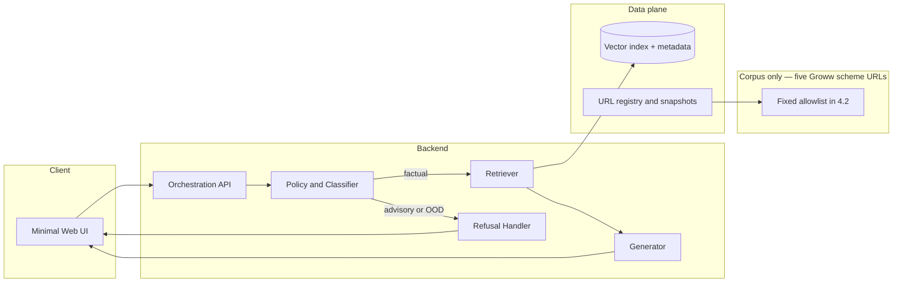
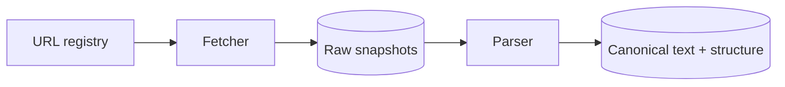
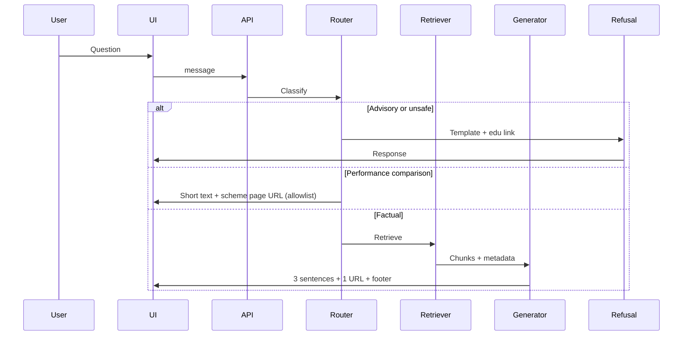

# Phase-Wise Architecture: Mutual Fund FAQ Assistant (Facts-Only RAG)

This document expands [problemStatement.md](./problemStatement.md) into a **phase-wise**, implementation-oriented architecture: components, data flows, guardrails, and exit criteria per phase.

## 1. Goals and non-goals

| Goals | Non-goals |
| ----- | --------- |
| Facts **only** from the **fixed five Groww scheme URLs** in **4.2** (same URLs for ingestion, citations, and any mandatory outbound links) | Portfolio advice, fund ranking, return predictions |
| **RAG**: retrieve → verify source → generate short grounded answers | Ingesting, citing, or emitting **any** URL outside that set (unless scope is reopened) |
| **≤3 sentences**, **exactly one** citation URL, **last updated** footer | Chat history tied to identity; omnichannel CRM integration (unless added later) |
| Reliable **refusal** for advisory prompts + **one** link from **4.2** only | Broader web crawling beyond the allowlist |

---

## 2. System context (logical view)

Groww-like **reference UX** is frontend-only inspiration; **trust boundary** is: user ↔ your app ↔ curated corpus ↔ Groq LLM. No PAN/Aadhaar/accounts/OTPs/contact PII in logs or storage.



---

## 3. Phase map (summary)

| Phase | Name | Primary outcome |
| ----- | ---- | ---------------- |
| 0 | Governance & corpus plan | Allowlist, schemes, compliance rules frozen |
| 1 | Ingestion pipeline | Versioned raw + parsed documents |
| 2 | Chunking & metadata | Retrieval units with **stable source URL** |
| 3 | Embeddings & index | Searchable vector store + filters |
| 4 | Retrieval layer | Top-k context with scheme/doc-type awareness |
| 5 | Generation & formatting | 3 sentences, 1 link, dated footer |
| 6 | Refusal & special intents | Advisory block + performance → scheme page (allowlist) |
| 7 | API & minimal UI | Stateless chat, disclaimer, examples |
| 8 | Evaluation & hardening | Metrics, regression set, operational runbooks |

Phases **0–3** are mostly **offline** (batch). **4–6** are **online** (per query). **7–8** cut across both.

---

## 4. Phase 0 — Governance and corpus plan

### 4.1 Objectives

- Lock **one AMC** (**HDFC Mutual Fund**), **five schemes**, and treat **these and only these** HTTPS URLs as the **exclusive allowlist**: ingestion, index, grounding, citations, refusals, and performance redirects may only use hyperlink targets from section **4.2**.
- **Do not add** AMC PDF microsites, AMFI, SEBI, blogs, aggregators, or additional Groww paths beyond exactly the paths below—the allowlist cardinality is **5**.

### 4.2 Project URL allowlist — Groww (exclusive corpus)

These are the **only** URLs the pipeline may fetch, chunk, cite, or emit:

**AMC (reference):** HDFC Mutual Fund / HDFC Asset Management Company — schemes presented on Groww.

| # | Scheme (Groww labeling) | URL |
| - | ------------------------ | --- |
| 1 | HDFC Mid Cap Fund — Direct Growth | https://groww.in/mutual-funds/hdfc-mid-cap-fund-direct-growth |
| 2 | HDFC Equity Fund — Direct Growth | https://groww.in/mutual-funds/hdfc-equity-fund-direct-growth |
| 3 | HDFC Focused Fund — Direct Growth | https://groww.in/mutual-funds/hdfc-focused-fund-direct-growth |
| 4 | HDFC ELSS Tax Saver — Direct Plan Growth | https://groww.in/mutual-funds/hdfc-elss-tax-saver-fund-direct-plan-growth |
| 5 | HDFC Large Cap Fund — Direct Growth | https://groww.in/mutual-funds/hdfc-large-cap-fund-direct-growth |

**Policy**

- **Ingestion / index:** Strictly these five canonical URLs (normalize trailing slashes/query params in tooling; store the canonical form in metadata).
- **Answers:** Exactly **one** citation per factual reply; it **must** be one of these five strings.
- **Refusals / performance routing:** Include **at most one** hyperlink and it **must** be one of these five (pick the scheme in context, or a team-default page such as Large Cap — document the rule in README).
- **Known trade-off:** Narrow coverage vs PDF-level regulatory documents; README should state this limitation plainly.

### 4.3 Artifacts

- **URL manifest**: five rows keyed by stable `scheme_id` with the exact URLs above (`doc_type` may be uniformly `groww_scheme_page` or equivalent).
- **Source policy**: re-fetch cadence, robots compliance, canonical URL normalization, broken-URL playbook (no widening allowlist except an explicit repo change).

### 4.4 Privacy and security (by design)

- No user accounts for MVP; **no** collection of PAN, Aadhaar, account numbers, OTPs, email, phone.
- Logging: **query text only** with configurable redaction; no device fingerprinting requirement for MVP.

### 4.5 Exit criteria

- **URL manifest** finalized: exactly the **five** URLs in **4.2** — no additions or substitutions without an explicit repo change to this document.
- Source policy signed off for fetch cadence and canonical URL normalization.

---

## 5. Phase 1 — Ingestion pipeline

### 5.1 Objectives

- Fetch and **snapshot** approved URLs (immutable `snapshot_id` + `fetched_at`).
- Normalize to **canonical text** (HTML → text, PDF → text) while preserving **section headings** where possible.

### 5.2 Components

| Component | Responsibility |
| --------- | ---------------- |
| Fetch worker | Respect `robots.txt`, rate limits, retries; record HTTP status + `Last-Modified` / `etag` |
| Parser | PDF (e.g. pdf.js / pypdf), HTML (readability-like extraction) |
| Deduplicator | Same PDF on multiple URLs → single logical doc with redirects noted |
| Provenance store | Blob or filesystem paths for raw files + parsed JSON/text |

### 5.3 Data flow



### 5.4 Subphases (implement one by one, in order)

Each subphase should be shippable on its own (tests or manual checklist) before moving on.

| Subphase | Focus | Outcome |
| -------- | ----- | ------- |
| **1.1** | Manifest wiring | Ingestion reads **only** URLs from Phase 0 manifest / `config/phase0/url_manifest.json`; no ad-hoc URL strings in fetch code. |
| **1.2** | Fetch + transport | HTTP client with timeouts, retries, stable user-agent, records final URL after redirects (must still match allowlist), stores status, `Last-Modified`, `ETag` when present. |
| **1.3** | Robots + rate limits | Respect `robots.txt` for `groww.in`; explicit backoff / concurrency cap; documented behavior when disallowed (fail with reason, do not bypass). |
| **1.4** | Raw snapshot store | Write immutable raw bytes per run with `snapshot_id`, `fetched_at`, `content_hash`, `source_url` canonical form; idempotent re-run path. |
| **1.5** | HTML extraction | Parse snapshot HTML to structured text (preserve headings where feasible); handle partial/empty body as failure with diagnostics. |
| **1.6** | Provenance manifest | Per URL (and snapshot): JSON or sidecar listing `scheme_id`, `snapshot_id`, hashes, HTTP metadata, parser version — ready for Phase 2 chunking. |
| **1.7** | Failure handling | Partial batch runs: per-URL success/failure report; no substitution of URLs; playbook aligned with `config/phase0/source_policy.md` (keep last good snapshot if applicable). |
| **1.8** | Operator entrypoint | Single CLI or script (e.g. `scripts/phase1_ingest.py`) that runs **1.1–1.7** for all five URLs and exits non-zero on policy violation or fatal errors. |

### 5.5 Exit criteria

- 100% of registry URLs ingest successfully or have a **documented failure** with owner action.
- Each document has: `source_url`, `snapshot_id`, `fetched_at`, `content_hash`.

---

## 6. Phase 2 — Chunking and metadata

### 6.1 Objectives

- Split documents into **semantic chunks** strictly along Markdown header boundaries (e.g., `#`, `##`) generated in Phase 1.
- Attach **rich metadata** for exact routing (`scheme_id`) and context (`heading_path`).

### 6.2 Recommended metadata (per chunk)

- `source_url` (must match an allowlisted URL; this becomes the **citation** candidate)
- `scheme_id`, `scheme_name`, `doc_type`
- `heading_path` (e.g. `Exit load > For SIP`)
- `snapshot_id`, `content_hash`
- `source_last_updated` (from document body date if present, else `fetched_at` — policy in Phase 0)

### 6.3 Chunking rules

- Never merge chunks across **different** `scheme_id` unless explicitly a cross-scheme AMC FAQ (then tag `scheme_id: multi`).
- **Semantic Boundaries Only**: Use Markdown headers to define chunk boundaries. Preserve extracted Markdown tables completely within their respective header chunk.

### 6.4 Exit criteria

- Every chunk maps to **one primary `source_url`** (the link you are allowed to show the user).

---

## 7. Phase 3 — Embeddings and index

### 7.1 Objectives

- Embed chunk text → vectors; store in a **vector index** with metadata filters.

### 7.2 Component choices (illustrative)

- **Embedding model**: domain-agnostic multilingual or English financial text; record model name/version in README.
- **Vector store**: local (e.g. Chroma/LanceDB) for demo; managed (e.g. Pinecone/pgvector) for production — same interface.

### 7.3 Index design

- **Collections** per environment (`dev`, `prod`) or single collection with `build_id`.
- Filters: `scheme_id`, `doc_type`, optional `locale`.

### 7.4 Exit criteria

- Rebuild index script is **deterministic** given `snapshot_id` set.
- Version file: `embedding_model`, `index_build_id`, `corpus_manifest_hash`.

---

## 8. Phase 4 — Retrieval layer

### 8.1 Objectives

- Given a factual query + optional scheme hint from UI or detected entities, retrieve **small, precise** evidence.

### 8.2 Retrieval strategy

1. **Metadata pre-filter (Strict Routing)**: When user selects a scheme or system detects a scheme name → physically restrict search to `scheme_id == X`. This eliminates cross-scheme hallucination.
2. **Hybrid Search**: Combine **Dense retrieval** (semantic vector search, e.g., top-k cosine similarity) with **Sparse retrieval** (BM25 keyword search) to capture both semantic intent ("how much to start") and exact jargon ("CAGR", "Exit load").
3. **Optional MMR** to reduce near-duplicate chunks from the same PDF page.
4. **Table-Preserving Context**: Feed the retrieved Markdown table chunks directly into the LLM context.

### 8.3 Grounding rule

- **Drop** retrieved chunks whose `source_url` is absent or not allowlisted — do not generate.

### 8.4 Exit criteria

- For a golden factual query set (Phase 8), **top-3** retrieval contains the answering passage ≥ target threshold (e.g. 85% manual check initially).

---

## 9. Phase 5 — Generation and response formatting

### 9.1 Objectives

- Produce **≤3 sentences**, **exactly one** user-visible URL, aligned with retrieved chunks.

### 9.2 Prompt/architecture pattern

- System instructions: facts-only; no advice; no comparisons; **if uncertain, say insufficient info in corpus** + one link chosen from **4.2** only.
- LLM Provider: **Groq** (using `llama3-8b-8192` or `llama3-70b-8192`).
- Provide model with: user question + **quoted excerpts** + `source_url` of the excerpt to cite.
- Post-process validator (code, not prompt-only):

  - Sentence count ≤ 3  
  - Exactly one `http(s)` URL in body  
  - Append footer: `Last updated from sources: <date>` (`date` = max(`source_last_updated`) used, or ingestion date — per policy)

### 9.3 Hallucination controls

- Prefer **extractive** phrasing (“According to …”) when possible.
- If chunks conflict, reply with discrepancy + exactly **one URL** from section **4.2** (prefer the chunk’s `scheme_id`) rather than merging numbers.

### 9.4 Exit criteria

- Automated or manual QA: citation URL ∈ allowlist and **appears in retrieved chunk metadata**.

---

## 10. Phase 6 — Refusal routing and performance queries

### 10.1 Query router (before heavy retrieval)

| Route | Detection (examples) | Behavior |
| ----- | -------------------- | -------- |
| **Advisory** | “Should I…”, “best fund”, “better than…” | Phase 6.2 |
| **Comparison / returns** | “Which is better”, “1Y return”, CAGR | Link only to scheme’s **4.2** Groww URL — no synthesized performance narrative |
| **OOD / personal** | PAN, portfolio upload, broker login | Safe refusal — no collecting |
| **Factual** | expense ratio, exit load, SIP min, ELSS lock-in, riskometer, benchmark | Full RAG path |

Implement with **deterministic keywords + lightweight classifier** (LLM optional); log `route_label` only.

### 10.2 Refusal template requirements

- Polite; restate facts-only scope; **single** hyperlink (when the product requires one) drawn **only** from **4.2** — e.g. scheme in context or a README-documented default—**never** off-list educational URLs while this policy stands.

### 10.3 Performance-safe path

- Return **≤3 sentences** explaining you do not compute or compare returns from the corpus; single link to **that scheme’s Groww URL** from **4.2** only (no return numbers synthesized by the model).

### 10.4 Exit criteria

- Advisory probes always **blocked** without fund recommendation language.
- Performance probes never contain numeric return summaries from the model.

---

## 11. Phase 7 — API and minimal UI

### 11.1 API (suggested shape)

- `POST /chat` or `POST /answer`  
  Body: `{ "message": string, "scheme_id"?: string }`  
  Response: `{ "answer": string, "citation_url": string, "route": "factual"|"refusal"|"performance_redirect", "build_id": string }`

 Stateless: no persisted conversation required for MVP; optional `session_id` **without PII**.

### 11.2 UI (per problem statement)

- Welcome message  
- Three example factual questions  
- Persistent disclaimer: **“Facts-only. No investment advice.”**

### 11.3 Exit criteria

- End-to-end latency acceptable for demo (define SLO explicitly in README).

---

## 12. Phase 8 — Evaluation, observability, and rollout

### 12.1 Golden sets

- **Factual**: 30–80 questions spanning expense ratio, exit load, SIP min, ELSS lock-in, riskometer, benchmark, statement download wording.
- **Negative**: advisory and comparison probes ensuring refusals.
- **Edge**: multilingual snippets if applicable; ambiguous scheme names.

### 12.2 Metrics

- **Citation validity rate** (% answers with allowlisted URL matching retrieval)
- **Refusal precision** (% advisory blocked)
- **Groundedness**: human eval or LLM-as-judge **only** on held-out labels; prefer human for compliance MVP

### 12.3 Operations

- Scheduled **re-ingestion** via **GitHub Actions** (weekly/daily cron) + automated index rebuild.
- **Corpus diff** alert when `content_hash` changes for snapshots of **any** of the five URLs in **4.2**.

#### 12.3.1 Implemented scheduler workflow

- Workflow file: `.github/workflows/refresh-corpus.yml`
- Triggers:
  - `schedule`: daily at `02:00 UTC` (`0 2 * * *`)
  - `workflow_dispatch`: manual run from Actions tab
- Pipeline sequence:
  1. `python scripts/phase1_ingest.py`
  2. `python scripts/phase2_chunk.py`
  3. `python scripts/phase3_embed.py`
- Runner/runtime:
  - `ubuntu-latest`
  - Python `3.11` (stable dependency compatibility)
- Artifact update behavior:
  - Stages changes under `data/ingestion`, `data/chunks`, and `data/index`
  - Commits/pushes only when there is an actual corpus/index diff
  - Commit message: `chore: refresh ingestion chunks and index`

### 12.4 Exit criteria

- Success criteria from [problemStatement.md](./problemStatement.md) demonstrably met on golden set + README documents limitations.

---

## 13. End-to-end query sequence (reference)



---

## 14. Deliverables checklist (cross-phase)

Aligned with README expectations from [problemStatement.md](./problemStatement.md):

- Setup instructions including **embedding model**, **vector store**, **rebuild corpus** commands  
- AMC + **exact five-URL Groww manifest** (see **4.2**) — no undocumented URLs  
- This architecture (`phase-wise-architecture`) + concise “RAG approach” summary in README  
- Known limitations: **corpus breadth** (five HTML pages only), stale snapshots, SPA/render gaps, multilingual coverage, hallucination residual risk  
- Disclaimer snippet in UI  

---

## 15. Dependency summary (recommended build order)

```text
Phase 0 (registry + policy)
    → Phase 1 (ingestion)
        → Phase 2 (chunks)
            → Phase 3 (embed + index)
                → Phase 4 (retrieve)
                    → Phase 5 (generate)
                        → Phase 6 (route/refuse/special intents)
                            → Phase 7 (API + UI)
                                → Phase 8 (evaluate + ops)
```

This order minimizes rework: citation and refusal rules (**0, 6**) should be drafted early; **evaluation** (**8**) should start defining golden questions in parallel after **Phase 2** chunk metadata stabilizes.
